# FFplay_0.4.0
---

## Environment

------
Environment | Value
-|-
OS | Windows 10 x64
IDE | Microsoft Visual Studio Community 2019

## SDL1.2

Download: <https://github.com/libsdl-org/SDL-1.2/releases/tag/release-1.2.15>

```bash
wget -c https://codeload.github.com/libsdl-org/SDL-1.2/zip/refs/tags/release-1.2.15
```

Open `SDL-1.2-release-1.2.15/VisualC/SDL.sln`

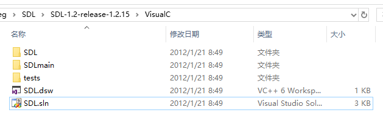

Upgrade

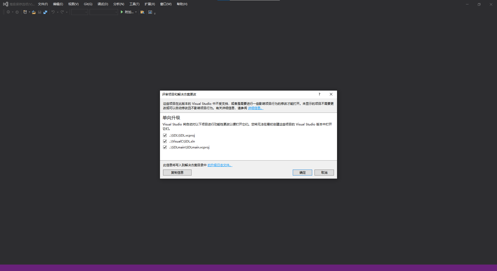

“SDL_config.h”: No such file or directory
`FFmpeg\SDL\SDL-1.2-release-1.2.15\src\audio\disk\SDL_diskaudio.c	24`	

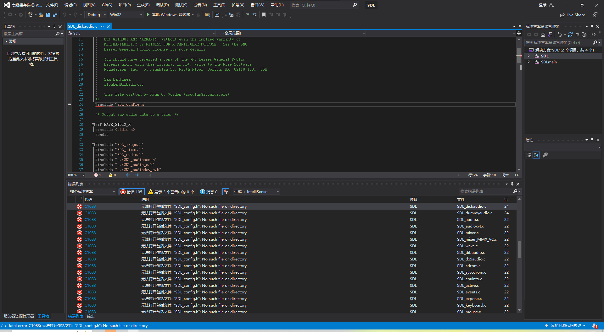

```bash
cp include/SDL_config.h.default include/SDL_config.h
```

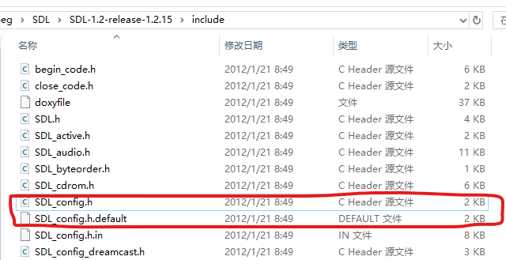

如果 `SDL_config.h` 不在项目中

右键 `SDL 项目` -> `添加` -> `现有项` -> `SDL_config.h`
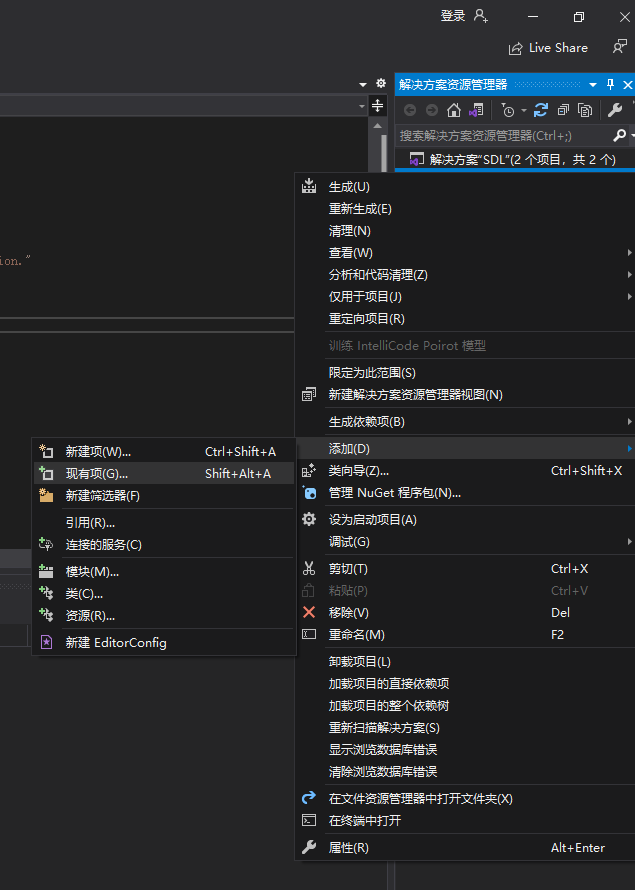

错误	`C2118`	负下标	SDL	`D:\Windows Kits\10\Include\10.0.19041.0\um\winnt.h`	2501	

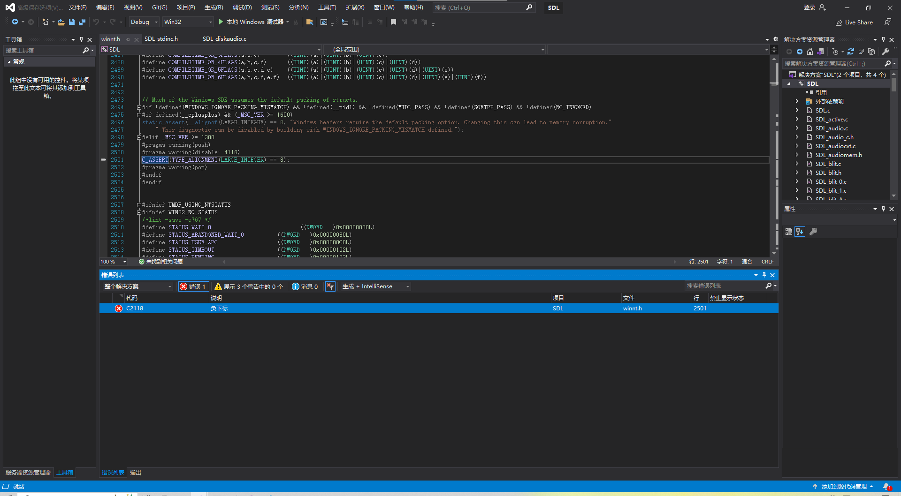

我这里使用的是在 `config.h` 开始定义 WINDOWS_IGNORE_PACKING_MISMATCH

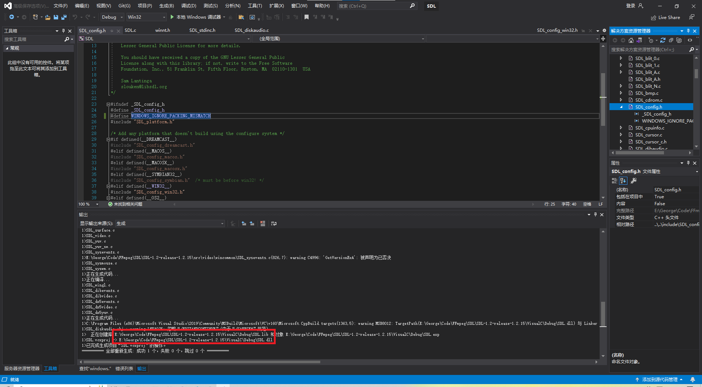

* VisualC\SDL\Debug\SDL.dll
* VisualC\Debug\SDL.lib
* VisualC\SDLmain\Debug\SDLmain.lib

复制到 SDL-1.2.15-lib/x86

### x64

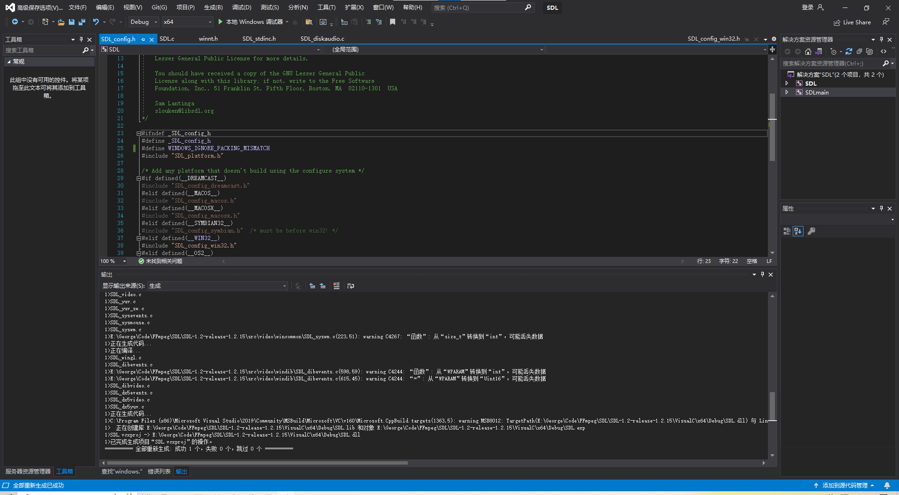

* VisualC\SDL\Debug\SDL.dll
* VisualC\x64\Debug\SDL.lib
* VisualC\SDLmain\Debug\x64\SDLmain.lib

复制到 SDL-1.2.15-lib/x64

查看 dll/lib/exe 是 x86 还是 x64：

```bash
dumpbin.exe /headers dll_or_lib_or_exe
```

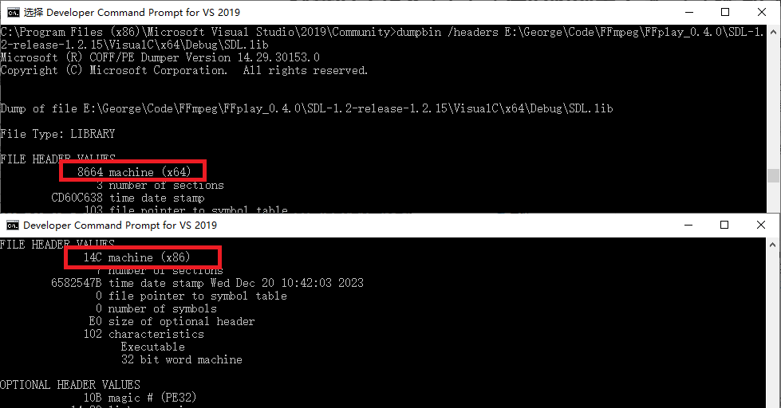

## FFplay 0.4.0

unzip `SDL-1.2.15-lib.zip`

Open `ffplay.dsp`

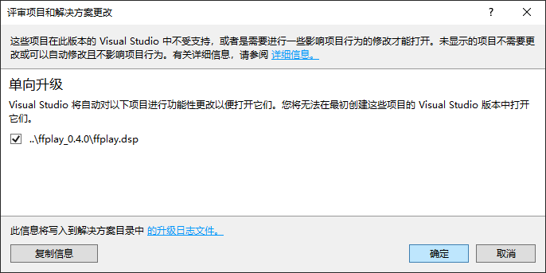

严重性	代码	说明	项目	文件	行	禁止显示状态
错误	D8016	“/ZI”和“/Gy-”命令行选项不兼容	ffplay	FFmpeg\FFplay_0.4.0\ffplay_0.4.0\cl	1	

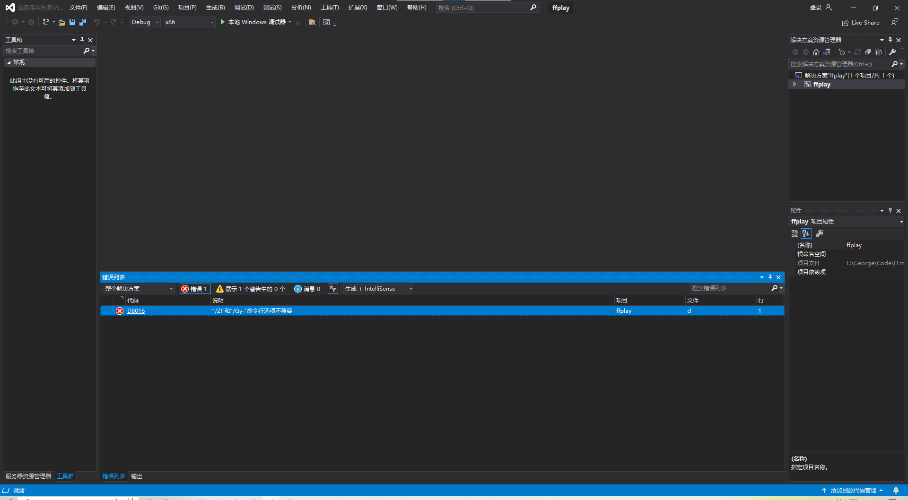

ffplay “项目”—>“属性”—>“C/C++”—>“常规”—>“调试信息格式”—>选择“程序数据库(/Zi)”或“无”

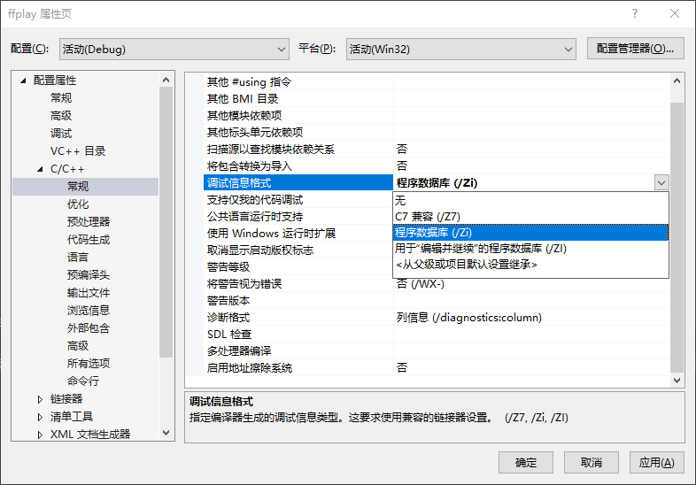

严重性	代码	说明	项目	文件	行	禁止显示状态
错误	C1083	无法打开包括文件: “SDL.h”: No such file or directory	ffplay	Code\FFmpeg\FFplay_0.4.0\ffplay_0.4.0\ffplay.c	15	

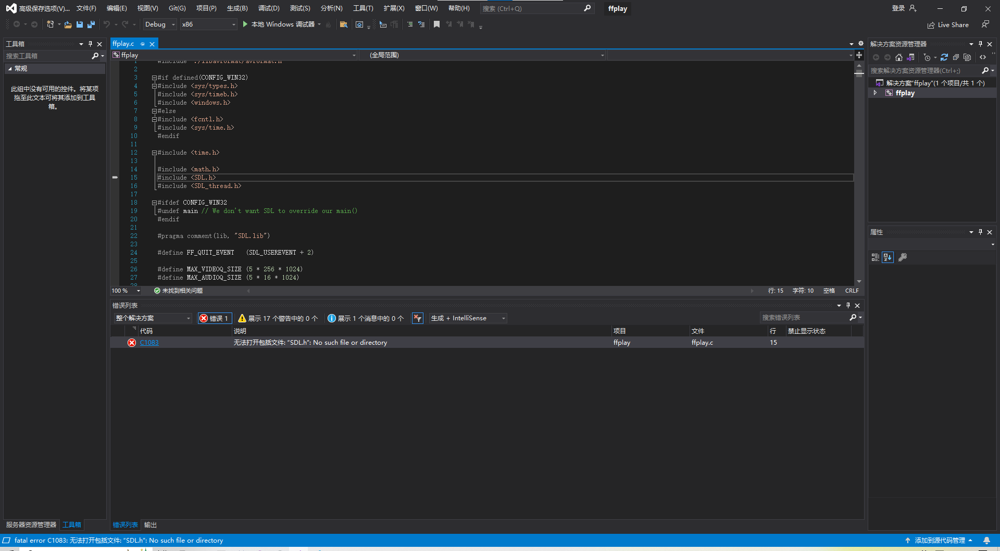

“VC++目录”->“包含目录”

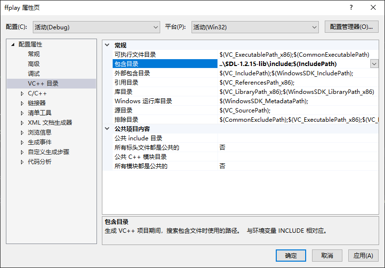

SDL.lib

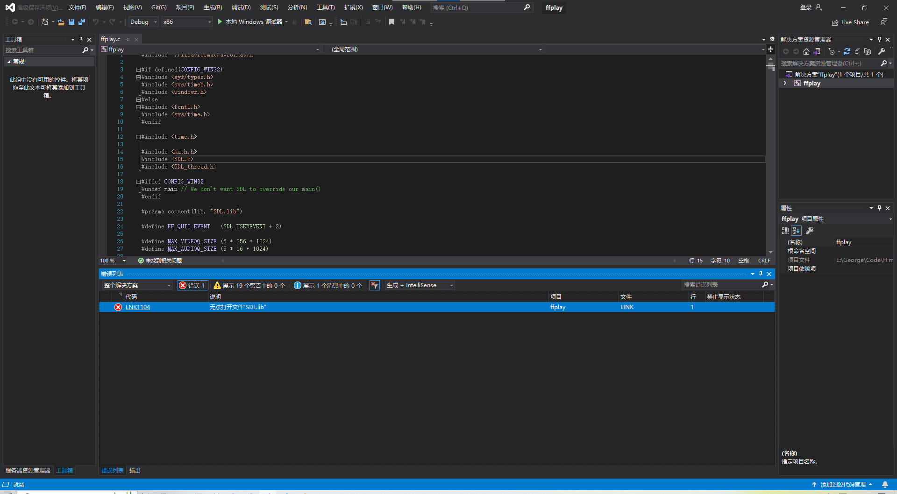

“VC++目录”->“包含目录”

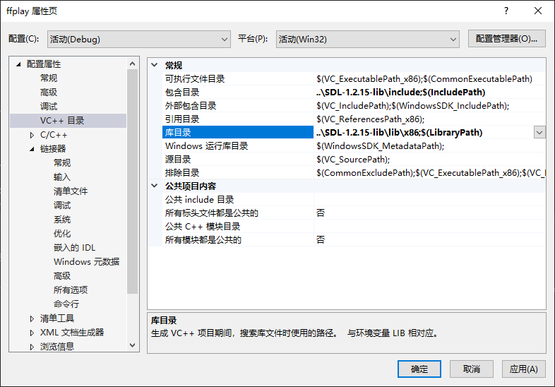

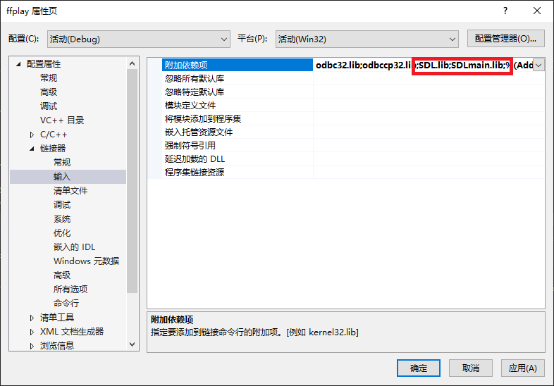

SDL.dll

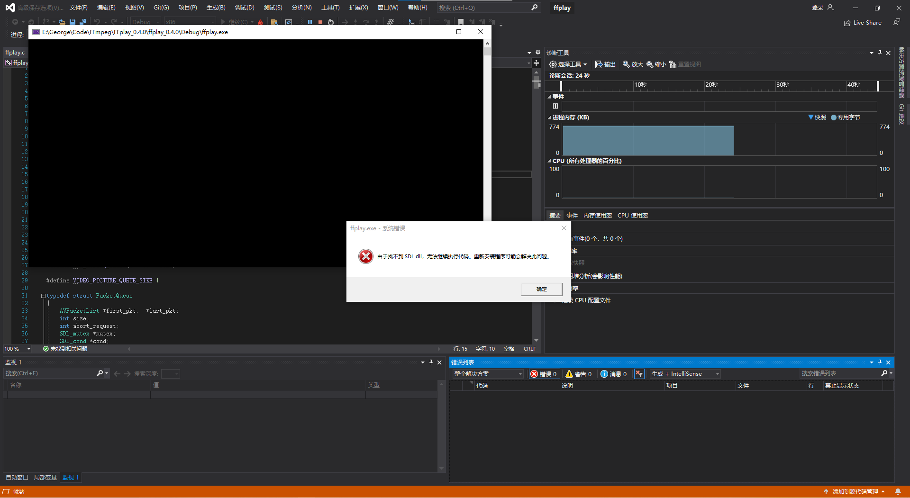

copy SDL.dll to Debug

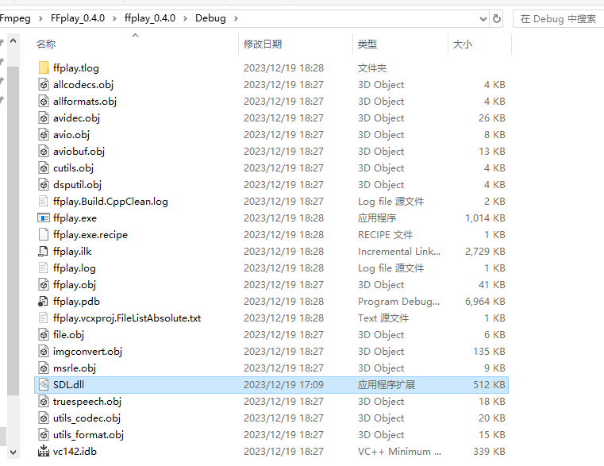

ffplay.exe

```c
input_filename = "CLOCKTXT_320.avi";
```

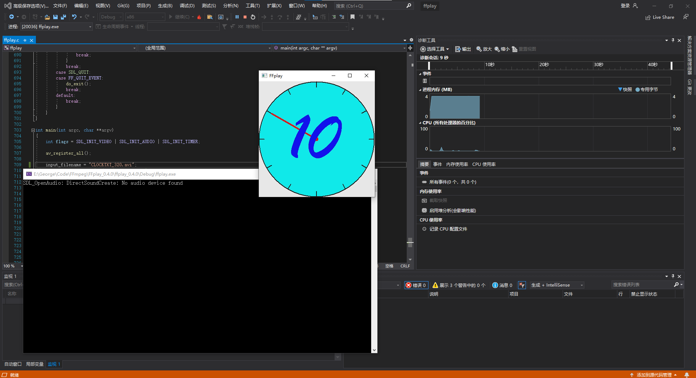

### x64

新建 `x64` 配置，并设置 include, lib。

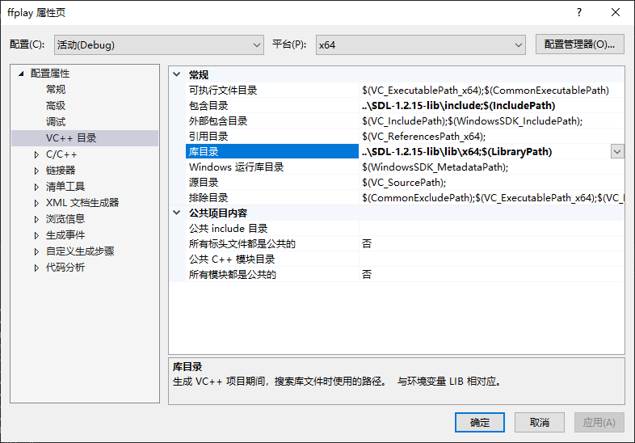


```diff
-#ifdef CONFIG_WIN32
+#ifdef _WIN32
```

* `CONFIG_WIN32` 只会在 x86/Win32 中定义
* `_WIN32` 在 x86/x64/Win32 中都会定义
* `_WIN64` 只在 x64 中定义

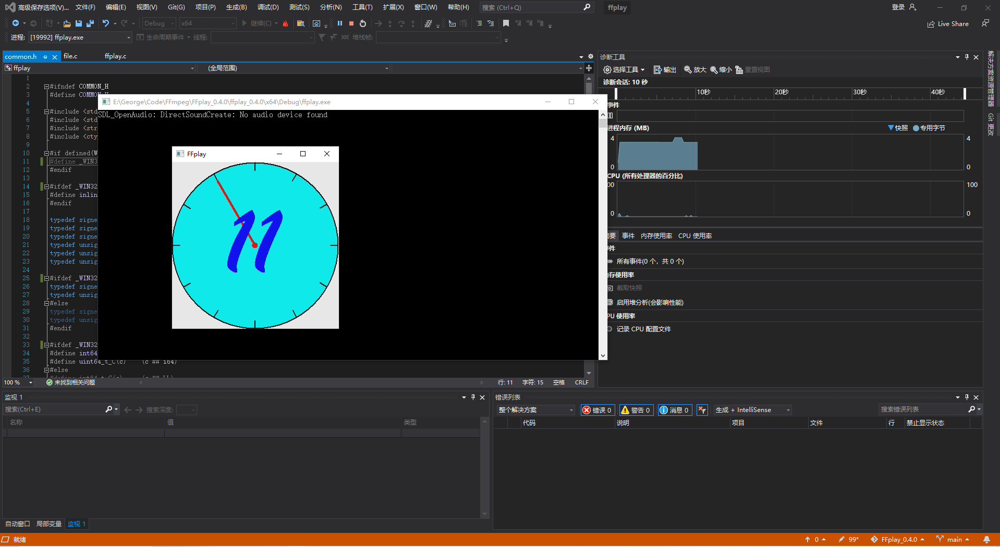

## Error

错误 C2118 表示在下标操作中使用了负数

    错误 C2118 表示在下标操作中使用了负数。在上述情况下，错误发生在 D:\Windows Kits\10\Include\10.0.19041.0\um\winnt.h 文件中的第 2501 行。

    根据 Stack Overflow 上的讨论，这个错误是由 SDL 库引起的。SDL 库在包含 Windows 头文件之前使用了 `#pragma pack` 指令。这会导致 Windows 头文件中的某些结构的对齐方式发生变化。在这种情况下，LARGE_INTEGER 结构的对齐方式从 4 字节更改为 8 字节。

    为了解决这个问题，可以将 begin_code.h 头文件包含在 windows.h 头文件之后。这样可以确保 Windows 头文件中的对齐方式设置不会被 `#pragma pack` 指令覆盖。

    具体的解决方法如下：

    ```C++
    #include <windows.h>
    #include <begin_code.h>
    ```
    如果您使用的是 older 版本的 SDL 库，则可以使用以下解决方法：


    ```C++
    #define WINDOWS_IGNORE_PACKING_MISMATCH
    ```
    这将告诉编译器忽略 Windows 头文件中的对齐方式设置。

    在您的具体情况下，我建议您尝试将 begin_code.h 头文件包含在 windows.h 头文件之后。如果这不能解决问题，您可以尝试使用 WINDOWS_IGNORE_PACKING_MISMATCH 宏。
